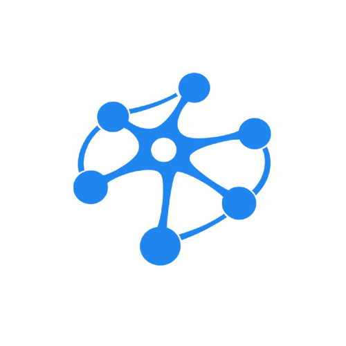

<div align="center">



[Documentation](docs/) • [Quickstart](docs/getting-started.md) • [Concepts](docs/concepts.md) • [Changelog](CHANGELOG.md)

<!-- Static badges render before the first publish. After publishing, swap the first two for:
     [](https://github.com/memnox/memnox-runtime/actions/workflows/ci.yml)
     [](https://www.npmjs.com/package/memnox) -->

[](packages/cli)
[](packages/sdk)
[](LICENSE)
[](package.json)

</div>

# Memnox

Memnox gives your AI agents a deterministic policy gate, human approvals, tamper-evident audit, delegated authority, and prompt-injection defense — so you can let agents act on real systems without hoping they behave.

**A refusal names what to use instead**, so the agent finishes the task under constraint rather than abandoning it and leaving you to blame the tool.

This is the Memnox runtime monorepo. It contains:

- [`memnox`](packages/cli): the CLI — set up, observe, tune, enforce, and approve from your shell
- [`@memnox/sdk`](packages/sdk): TypeScript SDK, plus [Python, Go, Rust, Java, and Swift](#client-sdks) clients
- [`@memnox/runtime`](packages/runtime): the decision gateway and HTTP API you run locally or for a team
- [`@memnox/organization`](packages/organization): the open client for asking an organization whether an action should happen, and who authorizes it
- [`@memnox/mcp-firewall`](packages/mcp-firewall): a transparent MCP proxy, so every `tools/call` is gated
- **Adapters** for MCP clients, OpenAI Agents, LangChain, and [more](docs/governing-agents.md)

## What it does

AI agents now write files, run shell commands, and call APIs on your behalf. Memnox sits between those agents and your systems, and decides on every action before it runs: **allow, withhold, or escalate to a person.**

```
AI Agent  ──▶  Memnox Runtime  ──▶  Your Systems
                    │
        Identity → Policy → Decision → Audit
```

Three things make that decision worth trusting.

**It is deterministic.** There is no LLM in the decision path, so the same input always produces the same decision. Security decisions need guarantees rather than probabilities.

**It is a gate, not a worker.** It answers *"is this allowed, and who authorizes it?"* and never does the work itself. Memnox reads an action request and decides on it; it never generates, edits, or commits anything, and runs no sandbox. Governing an agent and being an agent do not belong in the same trust boundary.

**It leaves proof.** Every decision appends one event to a hash-chained audit log, so you can replay any session and show exactly what was allowed, what was stopped, and under which rule.

## Start with no account at all

Before any rules, any login and any network call, one question is worth
answering: **what on this machine is already able to act, and what can it reach?**

```bash
npx memnox
```

```
AI AGENTS               claude-code, claude-desktop, cursor, codex-cli
MCP CLIENTS             claude-code, cursor

REACHABLE FROM AN AGENT RIGHT NOW

  !  ~/.ssh/id_ed25519         3 agents
  !  ~/.docker/config.json     3 agents
  !  /var/run/docker.sock      3 agents

11 execution surfaces.

  memnox doctor   what is risky and why
  memnox harden   fix it, reversibly
```

Nothing is transmitted. That is the only reason this is safe to run on a laptop
holding production credentials, and it is why the first four things Memnox does
need no account.

Finding a credential means opening the file it lives in — so the value stays in
the process that read it. What is stored is a path, a kind and a hash, and
`--json` lists every file it opened, so the tool that inspects your credentials
can itself be inspected.

`memnox doctor` ranks that into findings, each naming the one change that closes
it. `memnox harden` writes those changes, and **prints the undo before it runs**.

## Quickstart

```bash
npx memnox setup
```

That one command scaffolds a policy file from what it detects in your repository, registers a local agent, registers the MCP server (Model Context Protocol — how AI assistants connect to external tools) so your agent can ask about rules before it acts, and starts the runtime. **Restart your agent and it is governed.**

New to this? [Concepts and vocabulary](docs/concepts.md) explains agents, actions, approvals, and the rest in five minutes.

```
Wrote starter policies to memnox.policies.yaml (project: acme-checkout)
Detected: payments, database migrations, CI/CD, infrastructure as code
Packs: production-safety, terminal-safety, payments, money-movement, data-privacy, supply-chain
```

The first run **observes without blocking**, because a rule you have not read yet should not wedge your agent on minute one.

Ask it something before your agent does. This needs no traffic and no waiting:

```bash
memnox check shell.execute "rm -rf /"
```

```
Decision : ALLOW
Risk     : critical
Reason   : Recursive force-delete is withheld from agents.
Policies : recursive-delete-protection
Shadow   : withhold (this environment is only being observed)
```

That rule was scaffolded from your repository, nothing was withheld to produce
the answer, and the last line is what enforcing would have done. Then watch it
against real work:

```bash
memnox status   # is it on, what is in force, what would it have stopped
memnox audit    # every decision, newest first
```

```
Runtime   : http://127.0.0.1:7466
Policies  : 10 (version e852ac2d63d0)
Credential: stored (config)
Decisions : 214 recent
Waiting   : 1 approval(s)
Observed  : 9 would have been stopped if enforcing
```

That last line is the number to watch, because it tells you whether enforcing is safe yet. When the decisions look right, re-run as `memnox setup --enforce`.

Everything runs on your machine. No account, no API key, and no network call.

**→ [Full walkthrough: observe, tune, enforce, and the daily approval loop](docs/getting-started.md)**

## Six commands that answer with your own environment

Nothing below uses demo data or a hosted account. Every number comes from your rules, your agent, and your trail.

**`memnox test`** — fire real dangerous actions at your own gate and see which ones it stops. It is read-only by default: nothing is recorded and no action is taken.

```
  PASS  WITHHELD  Wipe a directory tree with rm -rf
        shell.execute "rm -rf /" — destructive-shell-protection
  PASS  ESCALATED Deploy to production unattended
        deploy.release "api" — production-deploy-approval
  GAP   ALLOWED   Force-push over shared git history
        repository.force_push "main" — no rule your organization wrote covers this

Result
  11 capabilities tested
  4 withheld, 1 escalated to a person, 6 allowed

  5 of these your agent can do right now, unattended:
    - Rewrite a credential file
    - Force-push over shared git history
```

It exits non-zero when something got through, so it belongs in CI. Add `--record` to put the run in the audit trail as a replayable session.

**`memnox describe <action> [target]`** — everything your organization attaches to one action, and how far the rules that catch it reach.

```
Governed by
  policy  production-database-protection — withholds
          also governs database.drop, database.truncate
  signal  behavior-guard — requires approval
          4 withheld attempts in the last 10 minutes — agent is probing policy boundaries

Who can authorise it
  team-lead

Observed
  1 of the last 11 audited actions — 1 withheld, 0 escalated, 0 allowed
```

**`memnox drift`** — where what your organization states and what its trail shows have come apart: verdicts a monitored environment let through, decisions agents keep running into, rules nothing has ever matched, decisions past review. Exits non-zero when it finds any.

**`memnox trace <eventId>`** — the evidence behind one recorded decision, link by link, with no model involved. Only what the record actually carries is ticked.

```
  Requested   shell.execute rm -rf /
       ↓
  Rules       destructive-shell-protection
       ↓
  Decision    WITHHOLD

Evidence
  ✓ agent identity    local-editor (f7652c84…)
  · human principal   not stated by the caller
  ✓ tamper evidence   chained — 000000000000… → b67f3c788bd1…
  · reported outcome  never reported
```

**`memnox why <decisionId>`** — the same decision in five lines, read back off the record: source, resource, authority, rule, outcome. Every line cites the rule version or the context block it came from. Nothing here is generated, because an explanation a model wrote afterwards is a plausible story about a decision, which is worse than none.

**`memnox learn`** — after a day of real work, what each agent was permitted, what it actually used, and what it never needed. Rendered as a policy file in the format a person writes.

```
  You granted this agent 14 action(s) and it used 27% of them.

  From 7 day(s), 31 session(s), covering 96% of its traffic.

  used            filesystem.read, repository.read
  never touched   cloud.write, database.delete
  tried, refused  filesystem.read .env  4×
```

Least privilege written from behaviour rather than from imagination. The window, the sessions and the coverage ride in a comment at the top of the file it writes, where they cannot be dropped in the retelling — four days of one developer's work is not a policy for a team, and a proposal that hid how little it saw would be a trap.

## What you actually get, in the order you get it

Each step is worth something on its own. Nothing below needs the step after it.

| When | What you run | What you did not have before |
|---|---|---|
| Minute 0 | `npx memnox` | A true list of what can act on this machine and what it can reach. No account, nothing transmitted. |
| Minute 1 | `memnox doctor` · `harden` | The worst of it closed, every step reversible, and the undo printed before it ran. |
| Minute 2 | `memnox setup` | Rules scaffolded from your own repository, and an agent that is governed the moment you restart it. |
| Minute 3 | `memnox test` | Proof, against your own gate, of which dangerous capabilities it actually stops — and which it does not. |
| Hour 1 | `memnox check` · `why` | A refusal your agent can act on, because it names what to use instead, and an explanation that reads the same a year later. |
| Day 1 | `memnox audit` · `replay` | A hash-chained record of every decision, replayable session by session. |
| Week 1 | `memnox learn` | The sentence nobody else can produce about your setup: *you granted this agent everything and it used twenty-seven percent of it.* |
| Week 2 | `memnox coverage` · `drift` | How much of what your agents do is really governed, weighted by risk — and where your stated rules and your actual history came apart. |
| When it matters | `memnox kill` · `panic` | One command stops an agent everywhere, and tells you every machine it could not reach. |

The order is not a funnel. **The first four rows need no account, no cloud and no network**, which is architecture rather than a free tier: if a capability works on one laptop with no login, putting it behind one would be the mistake people notice first.

## Beyond one machine

The runtime governs the agents on your laptop or in your cluster, free and Apache-2.0, forever. It answers one question completely: **does this action break a rule?**

There is a second question it cannot answer, because the answer is not in your repository. *Nothing forbids this refund, and it is still somebody's to authorize.* Who owns this system. What the company already decided last quarter. How much of the evidence this particular agent is entitled to see. Those are facts about an organization, gathered from systems you didn't write, and they are what **Memnox Cloud** holds. It is free for one person.

The two compose in one direction only: the runtime's refusal is final and the organization never widens it. The organization may only tighten an allow into an escalation — the case no policy file can express.

```ts
import { MemnoxOrganization, mayProceed } from '@memnox/organization';

const org = new MemnoxOrganization({ token: process.env.MEMNOX_GRANT!, workspace: 'acme' });

const answer = await org.evaluate({
  action: 'payment.refund',
  principal: 'sarah@acme.test',
  amount: 4500,
});

// answer.decision is allow · deny · ask · escalate · delegate · clarify,
// alongside the context this agent may use and the constraints it must respect.
if (mayProceed(answer)) await issueRefund();
```

That package is Apache-2.0 and deliberately thin: the protocol and nothing else, no tools, no execution, no copy of the organization. It never fails open — a call that cannot reach Memnox throws rather than returning a permissive default.

**→ [Connecting a runtime to a control plane](docs/connecting-a-control-plane.md)** · **→ [Running more than one runtime](docs/deploying-many.md)** · **→ [`@memnox/organization`](packages/organization)**

## Use it from code

```ts
import { MemnoxClient } from '@memnox/sdk';

const memnox = new MemnoxClient({ baseUrl: 'http://127.0.0.1:7466', token: agentToken });

// Inspect the decision yourself…
const decision = await memnox.check({ action: 'deploy.service', environment: 'production' });

// …or wrap the dangerous work, so it only runs if the runtime allows it.
await memnox.guard({ action: 'code.modify', target: 'payment/checkout.ts' }, async () => {
  await applyChanges();
});
```

Rules are plain YAML that you commit and review like any other code:

```yaml
- name: payment-code-approval
  match:
    actions: ["code.modify"]
    targets: ["payment/*"]
  decision:
    effect: escalate
    approvers: ["security-team"]
```

**→ [Writing policies](docs/policies.md)**

## Documentation

| Guide | What it covers |
|---|---|
| [Concepts and vocabulary](docs/concepts.md) | New here? The mental model and every term the other guides assume |
| [What can already act on this machine](docs/discovering-your-machine.md) | Discovery, doctor and harden — no account, no network |
| [Getting started](docs/getting-started.md) | From nothing to a governed agent, then observing, tuning, and enforcing |
| [Governing your agents](docs/governing-agents.md) | MCP clients, SDK callers, and agent frameworks. How an agent asks what the rules are |
| [Writing policies](docs/policies.md) | YAML rules, quorum, time windows, argument matching, and multi-repo projects |
| [How a decision is made](docs/how-it-works.md) | The five-step pipeline, approvals, provenance, and the platform API |
| [Learning from behaviour](docs/learning-from-behaviour.md) | A week of real work becomes a policy file you read, edit and commit |
| [Operating](docs/operating.md) | Coverage, containment, the census, readiness, and what you hand an auditor |
| [Deployment](docs/deployment.md) | Solo through enterprise, scaling flags, containers, audit verification, and metrics |
| [Running more than one](docs/deploying-many.md) | A runtime is one tenant; how several are deployed and reached together |
| [Connecting a control plane](docs/connecting-a-control-plane.md) | Reading across runtimes, mirroring the audit log off the box, setting enforcement without a restart |
| [Troubleshooting](docs/troubleshooting.md) | The failure modes people actually hit |
| [Architecture](ARCHITECTURE.md) | How each layer maps onto the code, and what the system deliberately does not do |

## Packages

This is a monorepo. Each package is one layer, and the two at the top have zero dependencies.

| Package | Purpose |
|---------|---------|
| [`@memnox/core`](packages/core) | Domain types, decision constants, and store ports. Zero dependencies. |
| [`@memnox/policy-engine`](packages/policy-engine) | Deterministic policy evaluation and risk classification. Zero dependencies. |
| [`@memnox/discovery`](packages/discovery) | What can act on this machine, what it reaches, and reversible harden steps. Zero dependencies. |
| [`@memnox/runtime`](packages/runtime) | The gateway, the HTTP API with RBAC, local stores, and compliance reports |
| [`@memnox/ledger`](packages/ledger) | The local record: usage against grant, unused grants, lineage, coverage, drift, cost |
| [`@memnox/workflow`](packages/workflow) | Durable runs, and the invariant that every route to a delegation passes a gate |
| [`@memnox/autonomy`](packages/autonomy) | Named levels a person grants, and readiness as queries nobody can tick |
| [`@memnox/memory`](packages/memory) | Team decisions turned into machine-checkable constraints |
| [`@memnox/risk`](packages/risk) | Deterministic behavioral signals such as novel destructive actions and bursts |
| [`@memnox/org-graph`](packages/org-graph) | Verified organizational statements, ownership, and delegated authority |
| [`@memnox/organization`](packages/organization) | The open client protocol for asking an organization |
| [`@memnox/mcp-firewall`](packages/mcp-firewall) | Transparent MCP proxy, so every `tools/call` goes through the runtime |
| [`@memnox/local-gate`](packages/local-gate) | In-process gate, so a call's arguments never leave the machine |
| [`@memnox/intelligence`](packages/intelligence) | Optional BYOK layer that drafts policy YAML. It never decides, explains, or infers intent. |
| [`@memnox/postgres`](packages/postgres) · [`@memnox/redis`](packages/redis) | Adapters for shared storage and locks |
| [`@memnox/sdk`](packages/sdk) · [`memnox`](packages/cli) | TypeScript client, and the CLI |

### Client SDKs

Ask the runtime for a decision from whatever your service is written in. Every client is dependency-free, covers the same surface, and runs its own suite in CI.

| Language | Package | Source |
|---|---|---|
| TypeScript | `@memnox/sdk` | [packages/sdk](packages/sdk) |
| Python | `memnox` | [sdks/python](sdks/python) |
| Go | `github.com/memnox/memnox-go` | [sdks/go](sdks/go) |
| Rust | `memnox` | [sdks/rust](sdks/rust) |
| Java | `ai.memnox:memnox` | [sdks/java](sdks/java) |
| Swift | `Memnox` | [sdks/swift](sdks/swift) |

## Contributing

Contributions are welcome, and the fastest way in is to run the test suite and read one package.

```bash
npm install
npm test           # vitest runs against source, so there is no build step
npm run build      # every package, through tsup
```

```
packages/          one package per layer
sdks/              client SDKs for python, go, rust, java, swift
docs/              guides
examples/          ready-to-use policy files and a governed agent
```

Before opening a pull request, these four must pass. CI enforces them plus the build, a publish dry run, and the five SDK suites:

```bash
npm run format && npm run typecheck && npm test && npm run deadcode
```

A few rules keep the codebase coherent: the decision path stays deterministic, no `any`, no magic values, and every behavior change ships with a test. New escalation logic is an `ActionAdvisor`, which may only tighten a decision and must never crash. [CONTRIBUTING.md](CONTRIBUTING.md) explains why each rule exists and shows how to test without processes or sockets.

## Design principles

**Deterministic core.** No LLM, no network calls, and no randomness in the decision path. Intelligence can draft and explain, and it never enforces.

**Fail closed.** Unknown identity, unreadable state, or ambiguous input produces a withhold rather than a guess.

**Everything auditable.** A decision that cannot be proven afterwards did not happen.

**Small, inspectable pieces.** This runtime governs what AI does in your environment, so you should be able to read every line of it.

**Ports over lock-in.** Storage sits behind small interfaces, the local adapters are plain JSON and JSONL files, and any backend can implement them.

## Support

- [Documentation](docs/) for guides, and [troubleshooting](docs/troubleshooting.md) when something breaks
- [Open an issue](https://github.com/memnox/memnox-runtime/issues) for bugs and feature requests
- `security@memnox.dev` for policy bypasses and audit-tampering findings. Never a public issue; see [SECURITY.md](SECURITY.md)

## License

[Apache-2.0](LICENSE)
